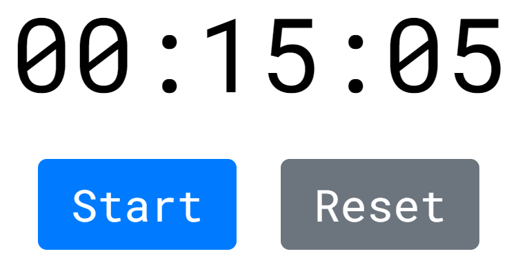

# This a simple React Timer

This application allows you to set a timer for something.

## How to use it

Press on the __Timer Display__ to set up the timer.
You can see the Settings of the Timer.
Write needing parameters and press the button __Done__.
After these actions press the button __Start__.
If you want to reset settings, just press the button __Reset__.

## That's all! Enjoy! :)
