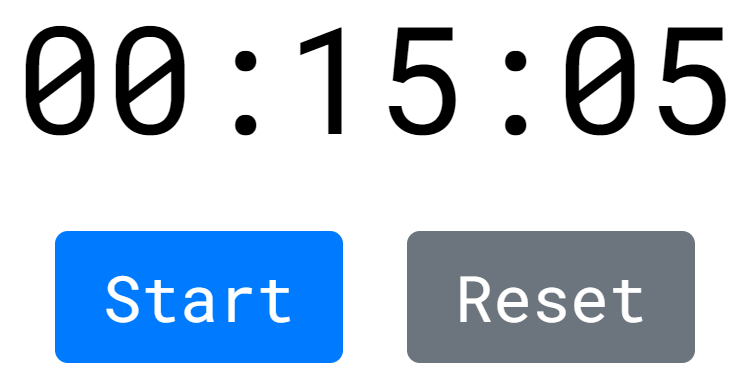

# This a simple React Timer

This application allows you to set a timer for something.

## How to use it

1. Press on the __Timer Display__ to set up the timer.
2. You can see the Settings of the Timer.
3. Write needing parameters and press the button __Done__.
4. After these actions press the button __Start__.
5. If you want to reset settings, just press the button __Reset__.

## That's all! Enjoy! :)
